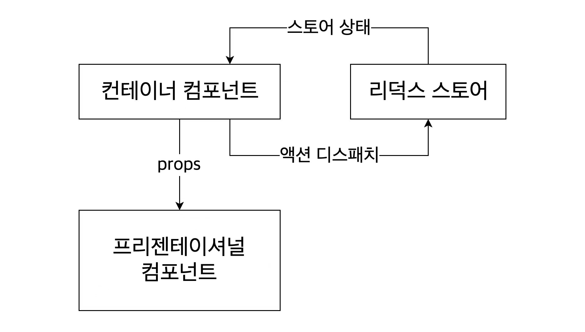

## 시작
    npx create-react-app 프로젝트이름
    yarn add redux
    yarn add react-redux

 

## 지난번 redux와의 차이점
1. 저번에 만든건 HOC이라는 옛날 패턴으로, connect를 사용했다.
2. 이번에 만든건 HOOK을 사용한다.

    https://github.com/Word-Word/reduxStudy  
      

----- 
  

## 설명 목차

A. 이 프로젝트의 구조       
B. HOC vs HOOK      
C. 리덕스 기본 예제 맛보기   

## 소스코드의 흐름
1. action과 reducers 여러개 합치기(combineReducers)
    src/modules/counter.js      
    src/modules/todos.js        
    src/modules/index.js        
      

2. Provider와 createStore
    src/index.js   

3. App.js
 

4. UI랑 상태관리 (components와 컨테이너)       
    src/components/Counter.js       
    src/containers/CounterContainer.js         

-----

## A. 이 프로젝트의 구조

#### HOC이 아니다.
HOC는 재사용되는 값, 함수를 Props로 받아올 수 있게 해주는 옛날 패턴이다.        
(참고로 클래스형에서는 connect로만 스토어에 연결할 수 있다)

 

#### HOOK
함수형 컴포넌트에서 주로 쓰는 방식.     
이 프로젝트는 이런 구조로 되어 있다.

 

- components 폴더 (프리젠테이션 컴포넌트)       
redux 스토어에 직접 접근하지 않고 필요한 값/함수를 props로만 받아와서 사용하는 컴포넌트. 주로 UI만 표현한다.

        src/components/Counter.js 파일

        

            <h1> {number} </h1>
            

                <input type="number" value={diff} onChange={onChange} />
                <button onClick={onIncrease}> + </button>
                <button onClick={onDecrease}> - </button>
            

        

 

- containers 폴더 (컨테이너 컴포넌트)       
리액스에 있는 상태를 조회하거나 액션을 디스패치할 수 있는 컴포넌트를 의미.

        src/containers/CounterContainer.js 파일

        import Counter from '../components/Counter';  // 위 UI를 가져온다.

 

        // useSelector로 값 가져오기

        const { number, diff } = useSelector(state => ({
            number: state.counter.number,
            diff: state.counter.diff
        }))

 

        // useDispatch로 값 바꾸기

        const dispatch = useDispatch();
        const onIncrease = () => dispatch(increase());

 

        // UI 불러오기

        return (
            <Counter       
                number={number}
                diff={diff}          
                onIncrease={onIncrease}
            />
        );

 

- HOOK 방식의 정리
리덕스 스토어 -> 컨테이너 컴포넌트 -> 프리젠테이셔널 컴포넌트  
프리젠테이셔널 컴포넌트는 단순히 UI만 선언하고,         
상태관리는 컨테이너 컴포넌트에 맡긴다.       
컨테이너 컴포넌트 <- 리덕스 스토어 (스토어의 현재 상태를 줌)        
컨테이너 컴포넌트 -> 리덕스 스토어 (액션 디스패치)

 

### [기타] Provider는 HOC와 HOOK 둘 다 사용한다.
리액트 앱에 store를 손쉽게 연동할 수 있도록 도와주는 컴포넌트

        <Provider store={store}>
            <App />
        </Provider>,

  

-----

## C. 리덕스 기본 예제 맛보기

        import { createStore } from 'redux';

 
// 초기값

    const initialState = {
        counter: 0,
        text: '',
        list: []
    };

 
// 액션 타입 정의

    const INCREASE = 'INCREASE';
    const DECREASE = 'DECREASE';
    const CHANGE_TEXT = 'CHANGE_TEXT';
    const ADD_TO_LIST = 'ADD_TO_LIST';

 
// 액션 생성 함수

    const increase = () => ({
        type: INCREASE,
    });

    const decrease = () => ({
        type: DECREASE,
    });

    const changeText = text => ({
        type: CHANGE_TEXT,
        text
    });

    const addToList = item => ({
        type: ADD_TO_LIST,
        item
    });

 
// 리듀서 작성

    function reducer(state = initialState, action) {
        switch (action.type) {
            case INCREASE:
                return {
                    // 기존 상태의 counter 값을 읽어서 1을 더하고 기존 값은 유지시키고 반환
                    ...state,
                    counter: state.counter + 1,
                };

            case DECREASE:
                return {
                    ...state,
                    counter: state.counter - 1
                }

                case CHANGE_TEXT:
                    return {
                        ...state,
                        text: action.text
                    }

                case ADD_TO_LIST:
                    return {
                        ...state,
                        list: state.list.concat(action.item)  // 기존의 list에 새로운 item을 추가한 새로운 배열을 만들어서 기존의 list를 대체시켜줌
                    }

            default:
                return state;
        }
    }

 
// 스토어

    const store = createStore(reducer);
    console.log(store.getState());  // store.getState()를 콘솔로 찍어보면 초기값이 잘 나온 것을 알 수 있다.

 
// 구독

    const listener = () => {
        const state = store.getState();
        console.log(state);
    }

 
// 구독 해제

    const unsubscribe = store.subscribe(listener);
    // unsubscribe();  // 구독해제

 
// 디스패치

    store.dispatch(increase());
    store.dispatch(decrease());
    store.dispatch(changeText('안녕'));
    store.dispatch(addToList({id:1, text: 'ㅇㅇ'}));

  

#### 기본 형태

----- 

## 1. action과 reducers 여러개 합치기

    src/modules/counter.js      
    src/modules/todos.js            
    src/modules/index.js        

 

<전체 흐름>
1. 맨 처음에 src 폴더에 modules 폴더를 만든다.
2. src/modules 폴더 안에 counter.js, todos.js 파일 2개를 만든다.
3. src/modules 폴더 안에 index.js 파일을 만들어서 위에서 만든 파일 2개를 연결한다.      
  

#### src/modules/counter.js

    // 초기값
    const initialState = {
        number: 0,
        diff: 1
    };

 
// 액션 타입 정의   (중복을 막기 위해 앞에 counter를 붙임)

    const SET_DIFF = 'counter/SET_DIFF';
    const INCREASE = 'counter/INCREASE';
    const DECREASE = 'counter/DECREASE';

 
// 리듀서 작성

    export default function counter(state = initialState, action) {
        switch (action.type) {
            case SET_DIFF:
                return {
                    ...state,
                    diff: action.diff,
                };

            case INCREASE:
                return {
                    ...state,
                    number: state.number + state.diff
                };

            case DECREASE:
                return {
                    ...state,
                    number: state.number - state.diff
                }

            default:
                return state;
        }
    }

  

#### src/modules/todos.js

    // 초기값
    const initialState = [

    ];

 
// 액션 타입 정의

    const ADD_TODO = 'todos/ADD_TODO';
    const TOGGLE_TODO = 'todos/TOGGLE_TODO'

 
// 액션 생성 함수

    let nextId = 1;
    export const addTodo = (text) => ({
        type: ADD_TODO,
        todo: {
            id: nextId++,
            text
        }
    });

    export const toggleTodo = id => ({
        type: TOGGLE_TODO,
        id
    })

 
// 리듀서 작성

    export default function todos(state = initialState, action) {
        switch (action.type) {
            case ADD_TODO:
                return state.concat(action.todo)
            case TOGGLE_TODO:
                return state.map(
                    todo => todo.id === action.id
                    ? { ...todo, done: !todo.done }
                    : todo
                )
            default:
                return state;
        }
    }

  

#### src/modules/index.js

    import { combineReducers } from 'redux';
    import counter from './counter';
    import todos from './todos';

    // combineReducers로 합쳐준다.
    const rootReducer = combineReducers({
        counter,
        todos
    })

    export default rootReducer;

여기서 combineReducers를 사용하여 2개의 리듀서를 합치고 있다.
 
 

-----

## 2. Provider와 createStore
Provider란 리액트 앱에 store를 손쉽게 연동할 수 있도록 도와주는 컴포넌트이다.

    src/index.js

  

src/index.js을 보면 아래 구간이 있다.

    ReactDOM.render(	
        <React.StrictMode>	
            <App />	
        </React.StrictMode>,	

        document.getElementById('root')	
    );	

 

이 구간을 다음과 같이 수정해준다.

    import { Provider } from 'react-redux';
    import { createStore } from 'redux';
    import rootReducer from './modules'  // modules의 index.js라는 이름으로 rootReducer를 내보냄

    const store = createStore(rootReducer);
    console.log(store.getState());      // 잘 되는지 확인

    ReactDOM.render(
        <Provider store={store}>
            <App />
        </Provider>,
        document.getElementById('root')
    );

rootReducer에서 맨 처음 작성한 modules 파일을 넣어주고 있다.

   

-----

## 3. App.js
카운터랑 Todo라는 두개의 기능을 하나로 붙인 케이스다.

    import React from 'react';
    import CounterContainer from './containers/CounterContainer';
    import TodosContainer from './containers/TodosContainer';

    function App() {

        return (
            

                <CounterContainer/>
                <TodosContainer/>
            

        );
    }

    export default App;

   

-----

## 4. components와 컨테이너       
카운터랑 Todo 중에서 비교적 간단한 카운터만 갖고 왔다.

    src/components/Counter.js       
    src/containers/CounterContainer.js     
 

UI

    import React from 'react';

    function Counter({ number, diff, onIncrease, onDecrease, onSetDiff }) {
        const onChange = e => {
            onSetDiff(parseInt(e.target.value, 10));
        }

        return (
            

                <h1> {number} </h1>
                

                    <input type="number" value={diff} onChange={onChange} />
                    <button onClick={onIncrease}> + </button>
                    <button onClick={onDecrease}> - </button>
                

            

        )
    }

    export default Counter;

 

컨테이너 컴포넌트 (상태관리 하는곳)

    import React from 'react';
    import Counter from '../components/Counter';
    import { useSelector, useDispatch } from 'react-redux';  // useSelector: 상태를 조회, useDispatch: 액션을 만들고 이를 디스패치
    import { increase, decrease, setDiff } from '../modules/counter';

    function CounterContainer() {

        // useSelector: 상태를 조회 (state가 가리키는 것: 우리가 만든 스토어에서 store.getState() 했을 때 반환하는 객체)
        const { number, diff } = useSelector(state => ({   // 비구조화 할당
            number: state.counter.number,
            diff: state.counter.diff
        }))

        // 우리는 언제든 dispatch를 사용해서 특정 액션을 발생시킬 수 있다
        const dispatch = useDispatch();
        const onIncrease = () => dispatch(increase());  // 모듈에서 불러온다
        const onDecrease = () => dispatch(decrease());  // 모듈에서 불러온다
        const onSetDiff = diff => dispatch(setDiff(diff));

        return (
            <Counter 
                number={number}
                diff={diff}
                onIncrease={onIncrease}
                onDecrease={onDecrease}
                onSetDiff={onSetDiff}
            />
        );
    }

    export default CounterContainer;

